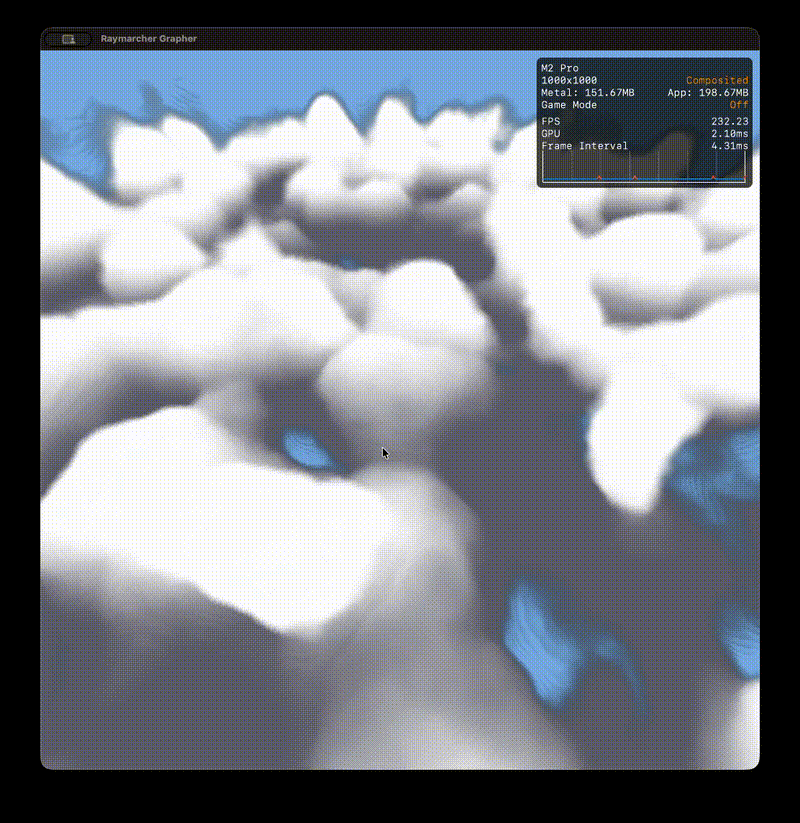

# Vulkan Volumetric Cone

> version 1.0
>
> **Status:** Project Under Construction!
>
> **Target:** a finished Demo for Digital Dragons 2026

A real-time 3D volumetric renderer written in `Vulkan` + `GLSL`.

  <table style="border: none;">
    <tr style="border: none;">
      <td style="border: none;">
        
<b>Cloud</b>

        
      </td>
      <td style="border: none;">
        
<b>Volumetric Integration</b>

        
      </td>
    </tr>
  </table>

## How to use?

Make sure you have the Vulkan API installed. You can looked that up [here](https://vulkan-tutorial.com/). You can clone the repository, build it and run it.

_important_:

- Toggle mode is right now build as hot reloader, and `bool cloud` has to be changed in the fragment shader.
- For the volumetric integrator you can change the function inside the fragment shader. 4 dimensions are accepted, x, y, z and time, i.e., $f(x, y, z, t)$ as an implicit function.
- Use WASD to orbit, Key 1 and 2 to zoom-in and out. Use Key x, y, and z same time with arrow keys to move along the axes.

## What is this project?

I wanted to have a demo for my portfolio until Digital Dragons, and I build these:

- Vulkan API 1.3.
- Cross platform (Explicit synchronization that passed on Mac M2 and Pop!\_OS with no validation error.)
- A volumetric integrator for implicit functions.
- Hart's distance estimator to get rid of some artifacts.
- Lambertian diffusion to "fake" lighting.
- Hot reload.
- A pre-calculated texture via a compute shader to keep the performance and frame rate high (for the cloud renderer).
- Noises used for the clouds are Perlin (value version) and Worley. They are fed to a fBM function. The hashed function by David Hoskins. [shader toy](https://www.shadertoy.com/view/4djSRW).
- A full working camera.
- toggling between pure volumetric integration and Cloud rendering.

## What is this project NOT?

- A scientific 3D renderer ready to change how humanity think about wave-functions.
- A triple-AAA engine ready to be used for the next GOATY.

## The "Accidental" Change of the Project Trajectory

This project started as a direct port of my [3D implicit grapher](https://github.com/ArminGEtemad/implicit_grapher_wgpu) from WGPU to Vulkan (just instead of sphere marching with volumetric integration). I was perfectly happy plotting mathematical surfaces until a friend saw some of my wavy test functions and asked: **"Oh, are you making clouds?"**

I wasn't... but I realized I definitely **should** be! However, since the program was originally a volumetric integration I am going to keep that in too.

So, the project has taken a wild turn! I've pivoted from a standard raymarching grapher to exploring **Volumetric Cone Integration** to create fluffy, procedurally generated atmospheres.

## Why Vulkan?

In my last two bigger projects [Reaction-Diffusion](https://github.com/ArminGEtemad/reaction_diffusion_wgpu) and the [3D Grapher](https://github.com/ArminGEtemad/implicit_grapher_wgpu) I used WGPU. I’m moving to Vulkan to get closer to the metal and to have a better understanding of the hardware, memory management, synchronizations and pipeline. My goal is being able to work on established engines and add custom functions.

## Technical Note

To keep the initial version lean, I have kept the window size constant and bypassed a complex parser. I'll be focusing heavily on the fragment and compute shader's mathematical efficiency and Vulkan's push constant stability.

## License

This project is under [MIT License](LICENSE)
