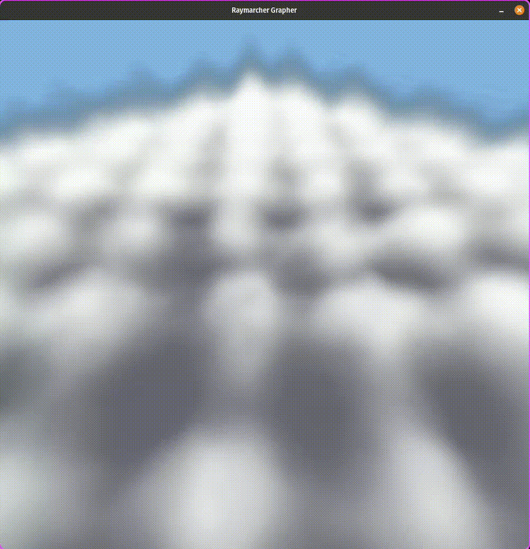

# Vulkan Volumetric Cone

> **Status:** Project Under Construction!
>
> **Target:** Having a finished Demo for Digital Dragons 2026

A real-time 3D volumetric renderer written in `Vulkan` + `GLSL`.

## The "Accidental" Change of the Project Trajectory

This project started as a direct port of my [3D implicit grapher](https://github.com/ArminGEtemad/implicit_grapher_wgpu) from WGPU to Vulkan (just instead of sphere marching with volumetric integration). I was perfectly happy plotting mathematical surfaces until a friend saw some of my wavy test functions and asked: **"Oh, are you making clouds?"**

I wasn't... but I realized I definitely **should** be!

  <table style="border: none;">
    <tr style="border: none;">
      <td style="border: none;">
        
<b>Cloud Prototype</b>

        
      </td>
      <td style="border: none;">
        
<b>Volumetric Integration</b>

        
      </td>
    </tr>
  </table>

So, the project has taken a wild turn! I've pivoted from a standard raymarching grapher to exploring **Volumetric Cone Integration** to create fluffy, procedurally generated atmospheres.

> **Alert:** The cloud implementation is currently in the **`Cloud`** branch. The `main` branch still contains the core grapher logic.

## Why Vulkan?

In my last two bigger projects [Reaction-Diffusion](https://github.com/ArminGEtemad/reaction_diffusion_wgpu) and the [3D Grapher](https://github.com/ArminGEtemad/implicit_grapher_wgpu) I used WGPU. It was awesome, but where is the fun if there is no suffering?

I’m moving to Vulkan to get closer to the metal and to master **Volumetric Integration**. I attempted this because that is what professionals do!

---

## Milestones

### Future Focus

- [ ] I have to research what I need to add until the Digital Dragons :)

### Moving to Clouds

- [x] Procedural Density: Implementing Fractional Brownian Motion.
- [x] Volumetric Cone Integration: Moving beyond sphere tracing for soft, translucent volumes.
- [x] Quintic Interpolation: Using $C^2$ continuous noise for smoother lighting gradients.

### Second Focus

- [x] Porting Implicit SDF Math from WGPU
- [x] Volumetric Cone Integration
- [x] Add dynamical scene

### First Focus

- [x] Basic Vulkan Setup: Core instance, device, and swapchain logic.
- [x] Bufferless Pipeline: Full-screen triangle setup for ray-per-pixel processing.
- [x] Camera System: First-person style navigation for "flying" through the volumes.

## Technical Note

To keep the initial version lean, I have kept the window size constant and bypassed a complex parser. I'll be focusing heavily on the fragment shader's mathematical efficiency (ALU usage) and Vulkan's push constant stability.
